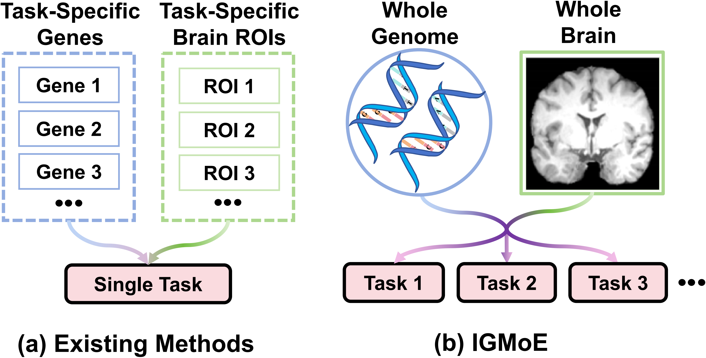

# IGMoE
Source codes for the paper "Hierarchical Mixture-of-Experts Framework for Whole-Brain Imaging and Whole-Genome Analysis of Multiple Cognitive Functions".

## Task Overview



## Training

```bash
# The training process of FMoE
python clip_mae_moe_rec_ukb_t1.py
# The training process of SMoE and FMoE
python clip_mae_moe_guide_rec_ukb_t1_s1.py
```

## License

This project is licensed under the MIT License - see the [LICENSE](LICENSE) file for details.
